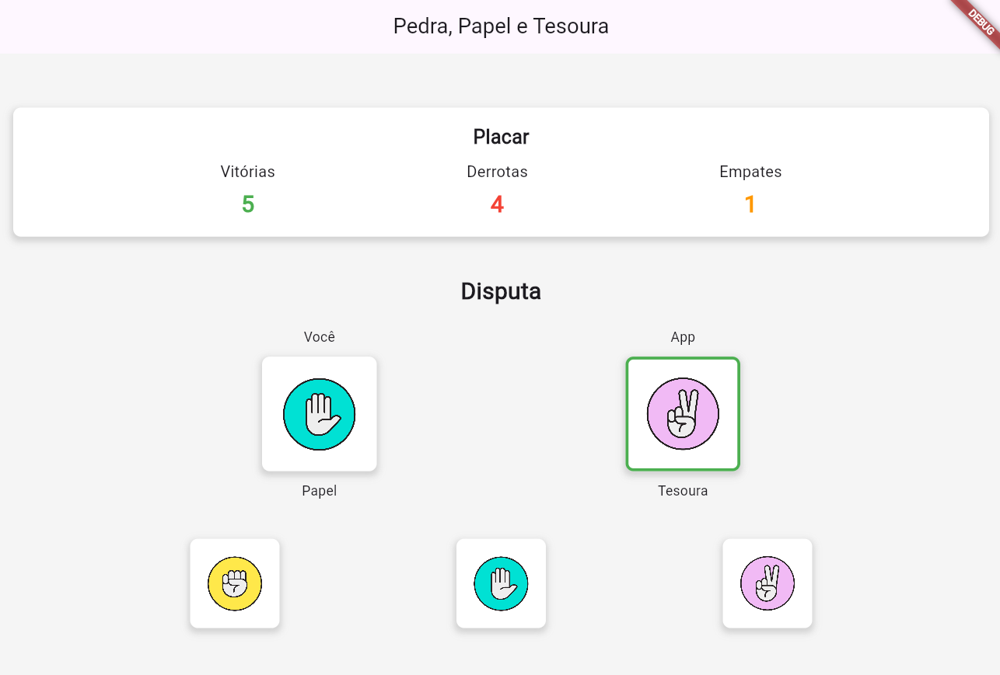

# Rock-Paper-Scissors
Jogo de Pedra, Papel e Tesoura desenvolvido em Flutter.
## 📸 Capturas de Tela

<div align="center">
  
  
  
</div>

## Funcionalidades

- Jogue contra o computador
- Placar dinâmico (vitórias, derrotas e empates)
- Visualização das jogadas (sua escolha vs escolha do app)
- Interface limpa e responsiva

## Como Executar

1. Certifique-se de ter o [Flutter instalado](https://flutter.dev/docs/get-started/install)
2. Clone o repositório:
   ```bash
   git clone https://github.com/rapharias01/Rock-Paper-Scissors.git
